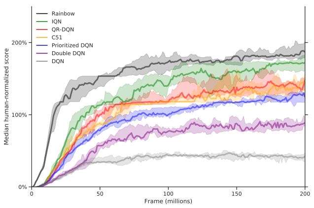

# DQN Zoo

_DQN Zoo_ is a collection of reference implementations of reinforcement learning
agents developed at DeepMind based on the
[Deep Q-Network (DQN)](http://www.nature.com/articles/nature14236) agent.

It aims to be research-friendly, self-contained and readable. Each agent is
implemented using [JAX](http://github.com/google/jax),
[Haiku](http://github.com/deepmind/haiku) and
[RLax](http://github.com/deepmind/rlax), and is a best-effort replication of the
corresponding paper implementation. Each agent reproduces results on the
standard set of 57 Atari games, on average.

<!-- mdformat off(for readability) -->

| Directory     | Paper                                                                                                    |
| ------------- | -------------------------------------------------------------------------------------------------------- |
| `dqn`         | [Human Level Control Through Deep Reinforcement Learning](http\://www.nature.com/articles/nature14236)   |
| `double_q`    | [Deep Reinforcement Learning with Double Q-learning](http\://arxiv.org/abs/1509.06461)                   |
| `prioritized` | [Prioritized Experience Replay](http\://arxiv.org/abs/1511.05952)                                        |
| `c51`         | [A Distributional Perspective on Reinforcement Learning](http\://arxiv.org/abs/1707.06887)               |
| `qrdqn`       | [Distributional Reinforcement Learning with Quantile Regression](http\://arxiv.org/abs/1710.10044)       |
| `rainbow`     | [Rainbow: Combining Improvements in Deep Reinforcement Learning](http\://arxiv.org/abs/1710.02298)       |
| `iqn`         | [Implicit Quantile Networks for Distributional Reinforcement Learning](http\://arxiv.org/abs/1806.06923) |

<!-- mdformat on -->

Plot of median human-normalized score over all 57 Atari games for each agent:



## Quick start

NOTE: Only Python 3.6 and above and Linux is supported.

Follow these steps to quickly clone the DQN Zoo repository, install all required
dependencies and start running DQN. Prerequisites for these steps are a NVIDIA
GPU with recent CUDA drivers.

<!-- mdlint off() -->

1.  Install [Docker](http://docs.docker.com/) version 19.03 or later (for the
    `--gpus` flag).
1.  Install [NVIDIA Docker](http://github.com/NVIDIA/nvidia-docker).
1.  Enable
    [sudoless docker](http://docs.docker.com/engine/install/linux-postinstall/).
1.  Verify the previous steps were successful by running: \
    `docker run --gpus all --rm nvidia/cuda:10.1-base nvidia-smi`
1.  Download and run the script [`run.sh`](run.sh). This script will:
    1.  Clone the DQN Zoo repository.
    1.  Build a Docker image with all necessary dependencies and run unit tests.
    1.  Start a short run of DQN on Pong in a GPU-accelerated container.

<!-- mdlint on -->

NOTE: `run.sh`, `Dockerfile` and `docker_requirements.txt` together provide a
self-contained example of the dependencies and commands needed to run an agent
in DQN Zoo. Using Docker is not a requirement and if `Dockerfile` is not used
then the list of dependencies to install may have to be adapted depending on
your environment. Also it is not a hard requirement to run on the GPU. Agents
can be run on the CPU by specifying the flag `--jax_platform_name=cpu`.

## Goals

*   Serve as a collection of reference implementations of DQN-based agents
    developed at DeepMind.
*   Reproduce results reported in papers, on average.
*   Implement agents purely in Python, using JAX, Haiku and RLax.
*   Have minimal dependencies.
*   Be easy to read.
*   Be easy to modify and customize after forking.

## Non-goals

*   Be a library or framework (these agents are intended to be forked for
    research).
*   Be flexible, general and support multiple use cases (at odds with
    understandability).
*   Support many environments (users can easily add new ones).
*   Include every DQN variant that exists.
*   Incorporate many cool libraries (harder to read, easy for the user to do
    this after forking, different users prefer different libraries, less
    self-contained).
*   Optimize speed and efficiency at the cost of readability or matching
    algorithmic details in the papers (no C++, keep to a single stream of
    experience).

## Code structure

*   Each directory contains a published DQN variant configured to run on Atari.
*   `agent.py` in each agent directory contains an agent class that includes
    `reset()`, `step()`, `get_state()`, `set_state()` methods.
*   `parts.py` contains functions and classes used by many of the agents
    including classes for accumulating statistics and the main training and
    evaluation loop `run_loop()`.
*   `replay.py` contains functions and classes relating to experience replay.
*   `networks.py` contains Haiku networks used by the agents.
*   `processors.py` contains components for standard Atari preprocessing.

## Implementation notes

Generally we went with a flatter approach for easier code comprehension.
Excessive nesting, indirection and generalization have been avoided, but not to
the extreme of having a single file per agent. This has resulted in some degree
of code duplication, but this is less of a maintenance issue as the code base is
intended to be relatively static.

Some implementation details:

*   The main training and evaluation loop `parts.run_loop()` is implemented as a
    generator to decouple it from other concerns like logging statistics and
    checkpointing.
*   We adopted the pattern of returning a new JAX PRNG key from jitted
    functions. This allows for splitting keys inside jitted functions which is
    currently more efficient than splitting outside and passing a key in.
*   Agent functions to be jitted are defined inline in the agent class
    `__init__()` instead of as decorated class methods. This emphasizes such
    functions should be free of side-effects; class methods are generally not
    pure as they often alter the class instance.
*   `parts.NullCheckpoint` is a placeholder for users to optionally plug in a
    checkpointing library appropriate for the file system they are using. This
    would allow resuming an interrupted training run.
*   The preprocessing and action repeat logic lives inside each agent. Doing
    this instead of taking the common approach of environment wrappers allows
    the run loop to see the "true" timesteps. This makes things like recording
    performance statistics and videos easier since the unmodified rewards and
    observations are readily available. It also allows us to express all
    relevant flag values in terms of environment frames, instead of a more
    confusing mix of environment frames and learning steps.

## Learning curves

<!-- mdlint off() -->

Learning curve data is included in [`results.tar.gz`](results.tar.gz). The
archive contains a CSV file for each agent, with statistics logged during
training runs. These training runs span the standard set of 57 Atari games, 5
seeds each, using default agent settings. Note
[Gym](http://github.com/openai/gym) was used instead of
[Xitari](http://github.com/deepmind/xitari).

<!-- mdlint on -->

These CSV files can be theoretically equivalently generated by the following
pseudocode:

```bash
for agent in "${AGENTS[@]}"; do
  for game in "${ATARI_GAMES[@]}"; do
    for seed in {1..5}; do
      python -m "dqn_zoo.${agent}.run_atari" \
          --environment_name="${game}" \
          --seed="${seed}" \
          --results_csv_path="/tmp/dqn_zoo/${agent}/${game}/${seed}/results.csv"
    done
  done
done
```

Each agent CSV file in `results.tar.gz` is then a concatenation of all
associated `results.csv` files, with additional `environment_name` and `seed`
fields. Note the learning curve data is missing `state_value` since logging for
this quantity was added after the data was generated.

Plots show the average score at periodic evaluation phases during training. Each
episode during evaluation starts with up to 30 random no-op actions and lasts a
maximum of 30 minutes. To make the plots more readable, scores have been
smoothed using a moving average with window size 10.

Plot of average score on each individual Atari game for each agent:


## FAQ

### Q: Do these agents replicate results from their respective papers?

We aim to replicate the mean and median human normalized score over all 57 Atari
games and to implement the algorithm described in each paper as closely as
possible.

However there are potential sources of differences at the level of an individual
game. These include:

*   Differences between [Gym](http://github.com/openai/gym) +
    [Arcade Learning Environment (ALE)](http://github.com/mgbellemare/Arcade-Learning-Environment)
    and [Xitari](http://github.com/deepmind/xitari).
*   Changes in underlying libraries such as the exact image resizing algorithm
    used in the observation preprocessing.
*   Atari ROM version.

### Q: Is the execution of these agents deterministic?

We try to allow for it on CPU. However it is easily broken and note that
convolutions on GPU are not deterministic. To allow for determinism we:

*   Build a new environment at the start of every iteration.
*   Include in the training state:
    *   Random number generator state.
    *   Target network parameters (in addition to online network parameters).
    *   Evaluation agent.

### Q: Why is DQN-based agent X not included?

There was a bias towards implementing the variants the authors are most familiar
with. Also one or more of the following reasons may apply:

*   Did not get round to implementing X.
*   Have yet to replicate the algorithmic details and learning performance of X.
*   It is easy to create X from components in DQN Zoo.

### Q: Why not incorporate library / environment X?

X is probably very useful, but every additional library or feature is another
thing new users need to read and understand. Also everyone differs in the
auxiliary libraries they like to use. So the recommendation is to fork the agent
you want and incorporate the features you wish in the copy. This also gives us
the usual benefits of keeping dependencies to a minimum.

### Q: Can I generalize X, then I can do Y with minimal modifications?

Code generalization often makes code harder to read. This is not intended to be
a library in the sense that you import an agent and inject customized components
to do research. Instead it is designed to be easy to customize after forking. So
rather than be everything for everyone, we aimed to keep things minimal. Then
users can fork and generalize in the directions they specifically care about.

### Q: Why Gym instead of Xitari?

Most DeepMind papers with experiments on Atari published results on
[Xitari](http://github.com/deepmind/xitari), a fork of the
[Arcade Learning Environment (ALE)](http://github.com/mgbellemare/Arcade-Learning-Environment).
The learning performance of agents in DQN Zoo were also verified on Xitari.
However since [Gym](http://github.com/openai/gym) and the ALE are more widely
used we have chosen to open source DQN Zoo using Gym. This does introduce
another source of differences, though the settings for the Gym Atari
environments have been chosen so they behave as similar as possible to Xitari.

## Contributing

Note we are currently not accepting contributions. See
[`CONTRIBUTING.md`](CONTRIBUTING.md) for details.

## Citing DQN Zoo

If you use DQN Zoo in your research, please cite the papers corresponding to the
agents used and this repository:

```
@software{dqnzoo2020github,
  title = {{DQN} {Zoo}: Reference implementations of {DQN}-based agents},
  author = {John Quan and Georg Ostrovski},
  url = {http://github.com/deepmind/dqn_zoo},
  version = {1.0.0},
  year = {2020},
}
```
